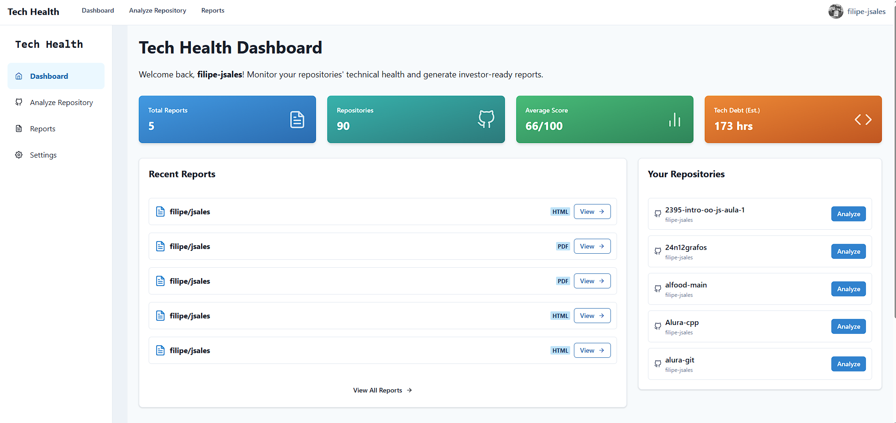

# Tech Health - Arquitetura do Sistema

## Visão Geral da Arquitetura

O Tech Health utiliza uma arquitetura modular em três camadas para proporcionar análise eficiente de códigos e geração de relatórios. A arquitetura foi projetada para ser escalável, segura e fácil de manter.

## Componentes Principais

### 1. API de Integração

O componente de integração é responsável por conectar o Tech Health a repositórios de código-fonte e sistemas de CI/CD.

#### Subcomponentes:
- **GitHub Connector**: Integração com a API do GitHub para extrair repositórios, commits, pull requests e outros dados
- **CI/CD Connector**: Integração com sistemas de CI/CD como GitHub Actions, GitLab CI, ou Jenkins
- **Authentication Service**: Gerencia tokens de acesso e autenticação segura com serviços externos

#### Tecnologias:
- FastAPI para endpoints RESTful
- PyGithub para integração com GitHub
- OAuth para autenticação segura

### 2. Motor de Análise

O motor de análise processa os dados extraídos da API de integração e executa análises detalhadas para determinar a saúde tecnológica do projeto.

#### Subcomponentes:
- **Code Quality Analyzer**: Avalia a qualidade do código-fonte (complexidade, manutenibilidade, etc.)
- **Commit Frequency Analyzer**: Analisa padrões de commit e atividade de desenvolvimento
- **Technical Debt Estimator**: Identifica e quantifica a dívida técnica
- **Security Scanner**: Verifica vulnerabilidades de segurança (opcional no MVP)
- **Benchmarking Engine**: Compara métricas com benchmarks do setor

#### Tecnologias:
- Python com bibliotecas específicas para análise (radon, pylint)
- Pandas para processamento de dados
- Algoritmos de machine learning para identificação de padrões (em versões futuras)

### 3. Gerador de Relatório

O gerador de relatório transforma os resultados da análise em um documento visual e informativo focado em investidores.

#### Subcomponentes:
- **Template Engine**: Sistema de templates para diferentes formatos de relatório
- **Data Visualization**: Geração de gráficos e visualizações a partir dos dados de análise
- **PDF Generator**: Conversão de relatórios para formatos exportáveis
- **Recommendation Engine**: Geração de recomendações específicas baseadas na análise

#### Tecnologias:
- Jinja2 para templates
- Matplotlib/Chart.js para visualizações

## Fluxo de Dados

1. **Extração**: A API de Integração extrai dados brutos dos repositórios e sistemas de CI/CD
2. **Processamento**: O Motor de Análise processa os dados brutos e calcula métricas
3. **Comparação**: As métricas são comparadas com benchmarks do setor
4. **Recomendação**: Recomendações são geradas com base na análise

## Uso de Ferramentas de IA

Durante o desenvolvimento deste projeto, várias ferramentas de IA foram utilizadas para aumentar a produtividade e melhorar a qualidade do código:

### Claude (Anthropic)

- **Propósito**: Auxiliou na criação e refinamento da documentação, incluindo este README
- **Benefício**: Permitiu uma documentação clara e abrangente, economizando tempo na elaboração da estrutura e revisão do conteúdo
- **Casos de uso específicos**: Estruturação da arquitetura do sistema, formatação do README e descrição detalhada dos componentes

### V0

- **Propósito**: Utilizado para desenvolver e otimizar a interface do usuário e elementos de frontend
- **Benefício**: Acelerou o desenvolvimento das páginas de visualização e do dashboard, permitindo iterações rápidas
- **Casos de uso específicos**: Criação de componentes visuais para o dashboard de análise e para a visualização de relatórios

### Ollama

- **Propósito**: Utilizado para gerar sugestões de código e recomendações técnicas
- **Benefício**: Ajudou a identificar oportunidades de melhoria de código e forneceu recomendações inteligentes para o motor de análise
- **Casos de uso específicos**: Desenvolvimento de algoritmos para análise de qualidade de código e estimativa de dívida técnica, geração de recomendações personalizadas baseadas nos resultados da análise

Estas ferramentas foram essenciais para cumprir o objetivo de desenvolver um MVP funcional no tempo alvo de 3-5 horas, permitindo um foco maior na arquitetura e funcionalidades core do sistema ao invés de detalhes de implementação.